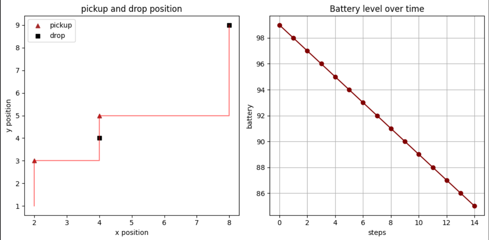

# WarehouseBot — Python Robot (Jupyter Notebook) Simulator

## Overview
WarehouseBot is a beginner Python project where I am building a warehouse delivery robot using Object-Oriented Programming. The robot can move step by step, perform pickup and drop tasks, and track battery usage.

## Features
- Robot movement system
- Task handling (pickup and drop)
- Battery tracking
- Position tracking

## Visualization
The robot's behavior is visualized using Matplotlib:

- Left: Robot path with pickup and drop positions
- Right: Battery level decreasing over time

## Technologies
- Python
- Object-Oriented Programming (OOP)
- Matplotlib

## Status
In progress — currently improving logic and planning GUI

## Future Improvements
- Add GUI interface
- Improve task scheduling
- Connect with real hardware in future
